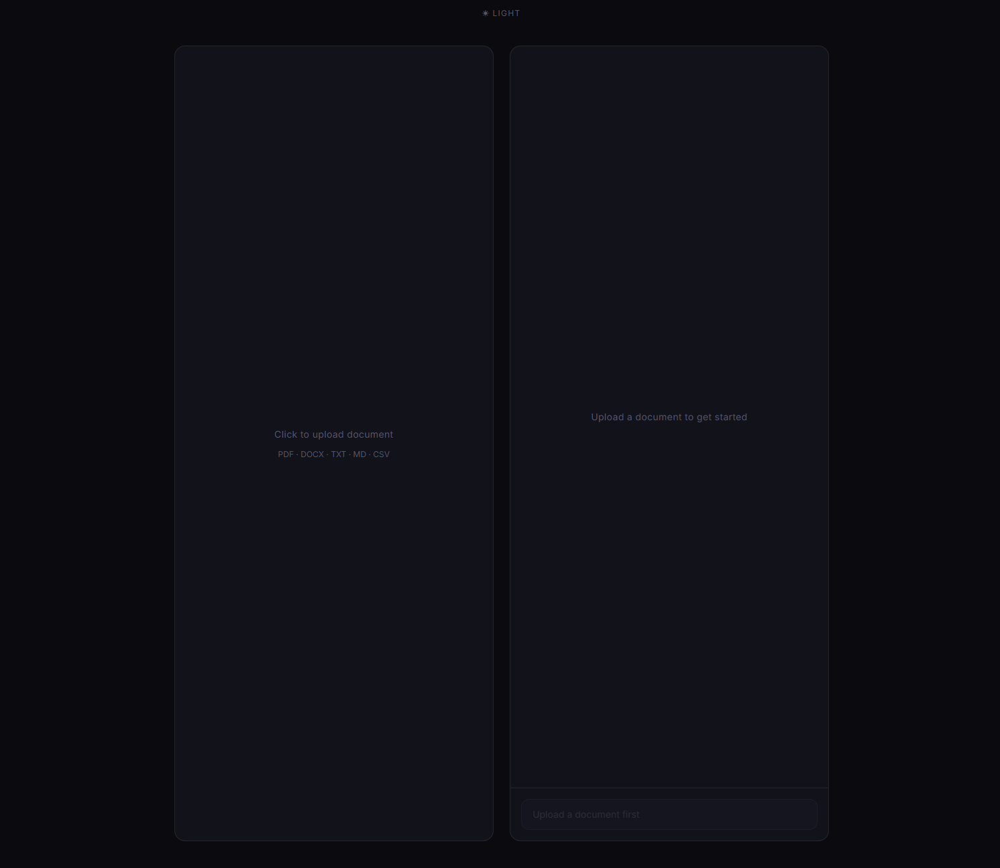
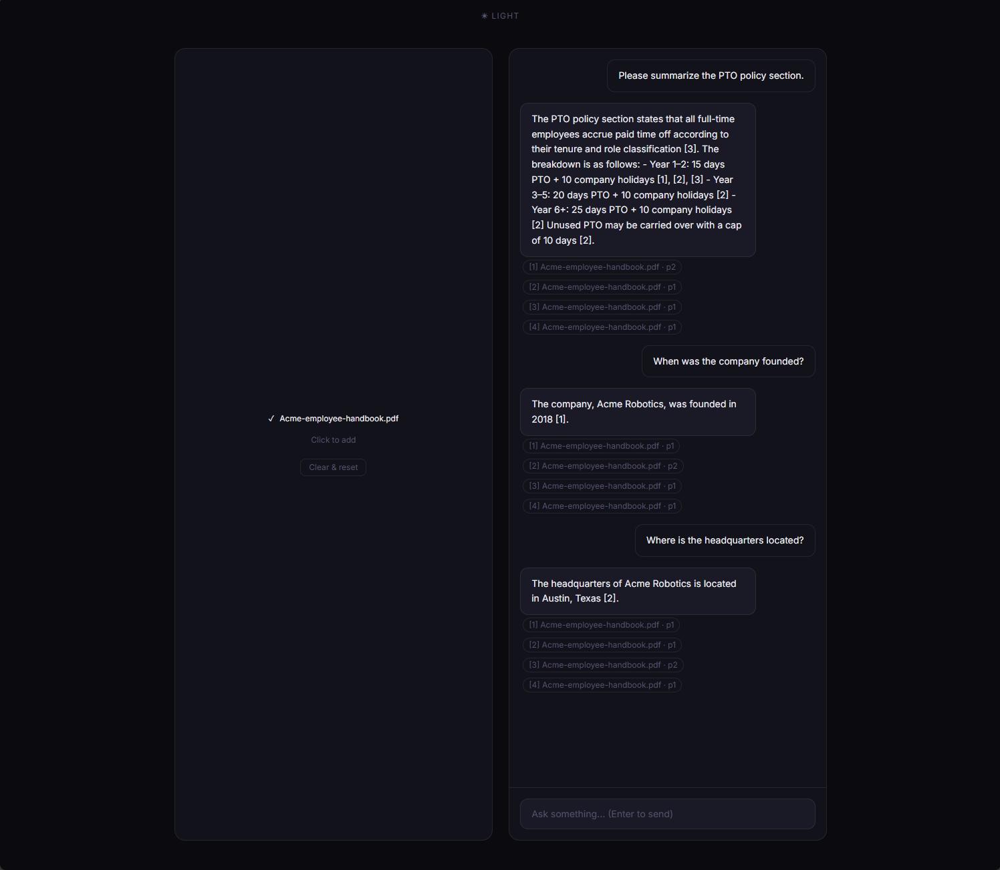
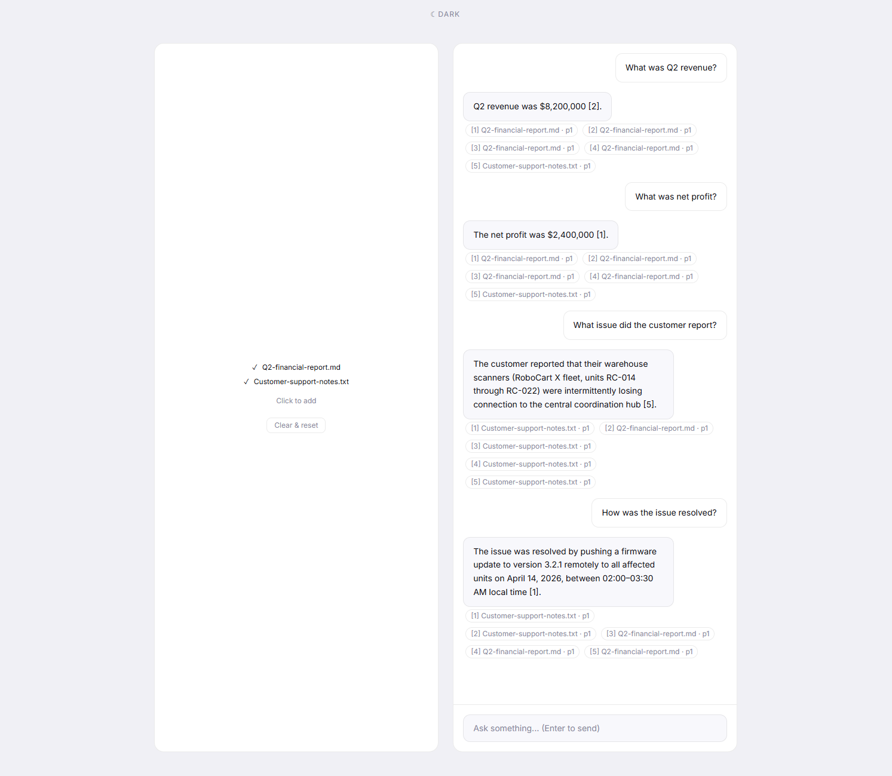

# RAG-Document-Assistant

Upload your documents. Ask anything. Get answers with sources.

An AI-powered document knowledge assistant built with a full RAG (Retrieval-Augmented Generation) pipeline. Upload documents, ask questions, and get accurate answers with cited sources — locally, for free.



---

## What it does

- Upload one or more documents and ask natural language questions about their contents
- Answers are grounded in your documents — not hallucinated — with inline citations referencing the exact source and page
- Supports querying across multiple documents simultaneously
- Light and dark mode with persistent preference

---

## Screenshots

**Single document query** — asking about the contents of an employee handbook PDF with cited responses



**Multi-document query** — querying across a financial report and customer support notes simultaneously, with citations tracking which answer came from which file



---

## Tech stack

**Backend**
- [FastAPI](https://fastapi.tiangolo.com/) — REST API with `/ingest` and `/query` endpoints
- [ChromaDB](https://www.trychroma.com/) — local vector store for chunk storage and retrieval
- [Ollama](https://ollama.com/) + [Nomic Embed](https://www.nomic.ai/blog/posts/nomic-embed-text-v1) — local embeddings, no API cost
- [Groq](https://groq.com/) — fast inference via `llama-3.3-70b-versatile` (free tier)
- [PyMuPDF](https://pymupdf.readthedocs.io/) — PDF text extraction
- [python-docx](https://python-docx.readthedocs.io/) — DOCX parsing
- [LangChain Text Splitters](https://python.langchain.com/docs/modules/data_connection/document_transformers/) — recursive character chunking

**Frontend**
- [React](https://react.dev/) + [Vite](https://vitejs.dev/)
- [Tailwind CSS v4](https://tailwindcss.com/)
- CSS custom properties for light/dark theming

---

## How it works

```
Document upload
     │
     ▼
PDF / DOCX / TXT / MD / CSV parser
     │
     ▼
Recursive text chunker (~500 tokens, 50 overlap)
     │
     ▼
Nomic Embed (local via Ollama) → vector embeddings
     │
     ▼
ChromaDB (local vector store)
```

```
User question
     │
     ▼
Embed question with Nomic
     │
     ▼
Top-K similarity search → relevant chunks retrieved
     │
     ▼
Groq (llama-3.3-70b-versatile) → answer + inline citations
     │
     ▼
Response rendered in chat UI with source pills
```

---

## Supported file types

| Format | Notes |
|--------|-------|
| `.pdf` | Full text extraction via PyMuPDF with page tracking |
| `.docx` | Paragraph extraction via python-docx |
| `.txt` | Plain UTF-8 text |
| `.md` | Markdown files treated as plain text |
| `.csv` | Rows converted to readable text for LLM reasoning |

---

## Getting started

### Prerequisites

- Python 3.10+
- Node.js 18+
- [Ollama](https://ollama.com/) running locally with Nomic Embed pulled
- A free [Groq API key](https://console.groq.com/)

### Backend setup

```bash
cd backend
pip install -r requirements.txt
```

Pull the embedding model:
```bash
ollama pull nomic-embed-text
```

Create a `.env` file in the project root:
```
GROQ_API_KEY=your_key_here
```

Start the API:
```bash
python -m uvicorn main:app --reload
```

### Frontend setup

```bash
cd frontend
npm install
npm run dev
```

Visit `http://localhost:5173`

---

## Project structure

```
AIAssistant-rag/
├── backend/
│   ├── main.py           # FastAPI app and route definitions
│   ├── ingest.py         # Document parsing, chunking, embedding
│   ├── query.py          # Retrieval, Groq call, citation builder
│   ├── vectorstore.py    # ChromaDB connection helper
│   ├── config.py         # Environment variables and constants
│   └── requirements.txt
├── frontend/
│   └── src/
│       ├── App.jsx       # Main UI — upload panel + chat interface
│       └── api.js        # Axios calls to backend
├── .env                  # GROQ_API_KEY (not committed)
└── README.md
```

---

## Design decisions

**Why Groq instead of OpenAI?** Groq's free tier provides access to Llama 3.3 70B with fast inference — no cost for development or demos.

**Why local embeddings?** Nomic Embed running through Ollama keeps the entire embedding pipeline free and offline. The embedding quality is competitive with OpenAI's ada-002.

**Why ChromaDB?** Zero infrastructure — persists to disk locally with no external service required. Straightforward to swap for Pinecone or Weaviate in a production deployment.

---

## Roadmap

- [ ] Image support via OCR (Tesseract)
- [ ] Streaming responses
- [ ] Auto-scroll to latest message
- [ ] Mobile responsive layout
- [ ] Deployable Docker setup